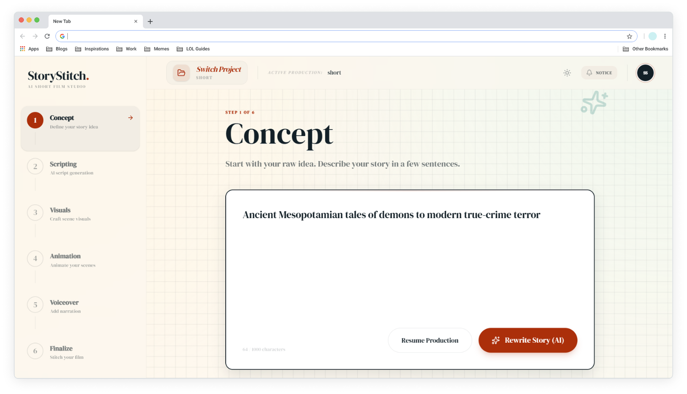
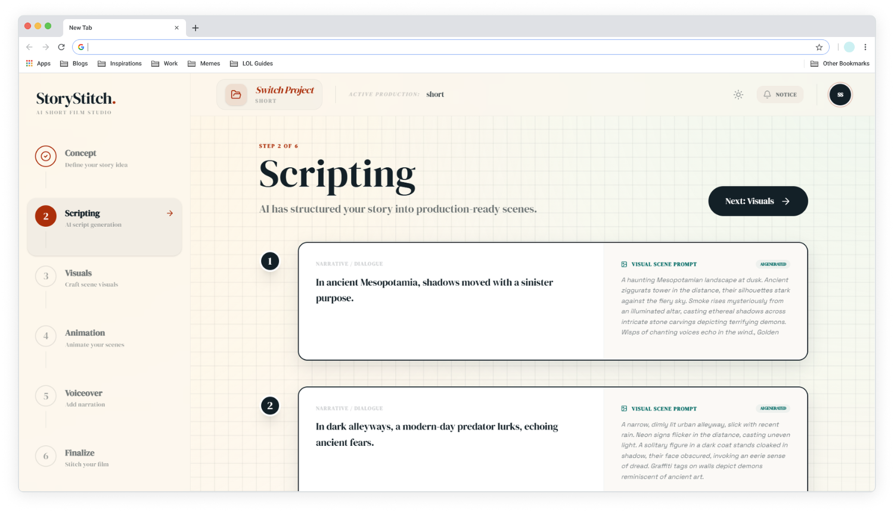
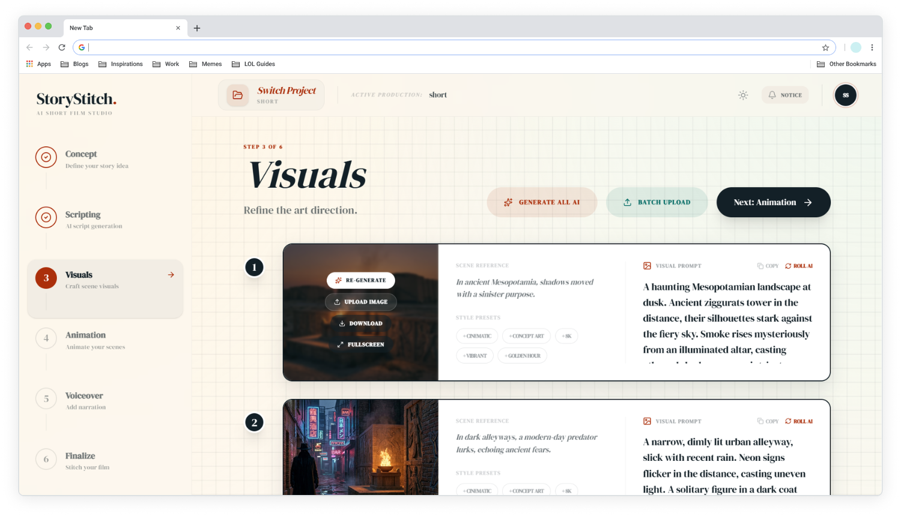
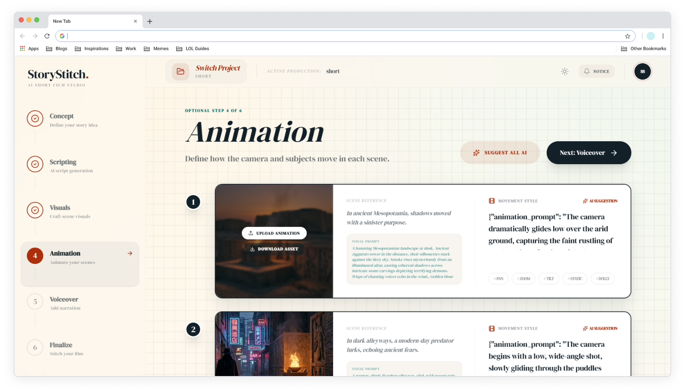
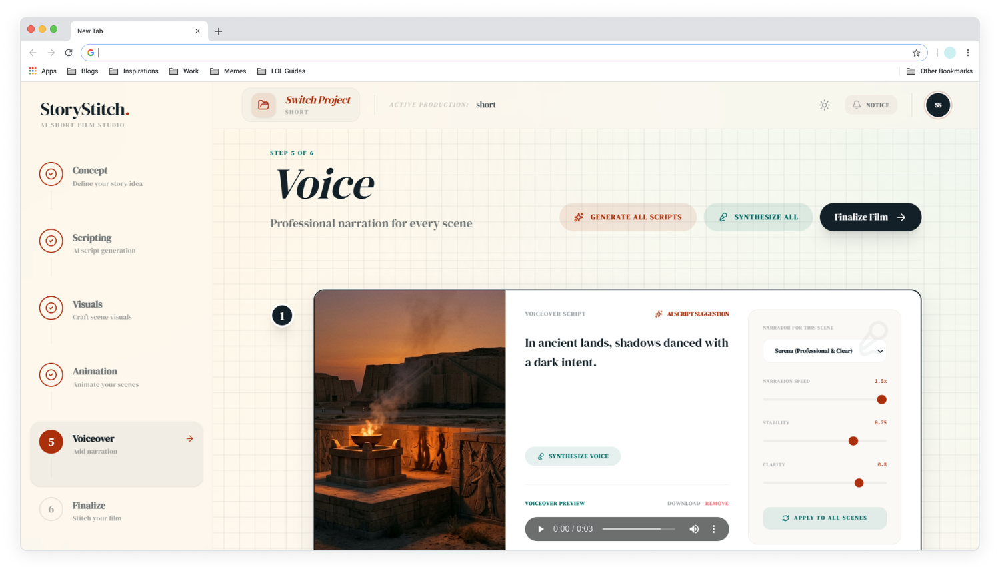
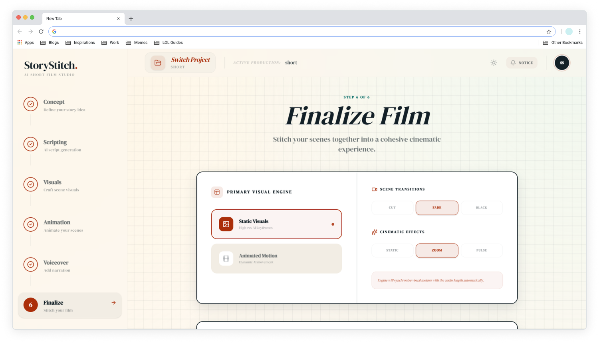

<div align="center">

<em>StoryStitch AI-powered cinematic production pipeline designed to transform simple concepts into fully-fledged, high-quality video stories.</em>
<br>

[](https://deepwiki.com/muhdaliyan/story-stitch)
[](https://www.linkedin.com/in/muhdaliyan/)
[](https://x.com/muhdaliyan_)
[](https://bsky.app/profile/muhdaliyan.bsky.social)
[](https://www.instagram.com/a1iyan__/)

  

</div>

---

## 📸 App Preview

<div align="center">
  <table>
    <tr>
      <td width="50%"></td>
      <td width="50%"></td>
    </tr>
    <tr>
      <td width="50%"></td>
      <td width="50%"></td>
    </tr>
    <tr>
      <td width="50%"></td>
      <td width="50%"></td>
    </tr>
  </table>
</div>

---

## ✨ Key Features

- **🧠 Intelligent Scripting**: Leverages Gemini to expand your core concepts into detailed, multi-scene cinematic scripts.
- **🖼️ AI Visual Generation**: Integrated with `gemini-2.5-flash-image` to generate ultra-high-quality cinematic stills in both Widescreen (16:9) and Vertical (9:16) formats.
- **🎙️ Automated Voiceovers**: Synthesizes professional narration for every scene to bring your story to life.
- **📽️ Professional Rendering Engine**: Uses **FFmpeg.wasm** for in-browser video stitching, complete with:
  - **Transitions**: Smooth crossfades and fade-to-black.
  - **Cinematic Effects**: Dynamic Ken Burns (zoom) effects for static images.
  - **Adaptive Aspect Ratios**: Optimized for YouTube, TikTok, and Instagram Reels.
- **⚡ Premium UX**: A beautifully crafted, dark-themed interface built with **Framer Motion** for a seamless, "alive" experience.

---

## 🛠️ Tech Stack

### Frontend
- **Framework**: [React 19](https://react.dev/) + [TypeScript](https://www.typescriptlang.org/)
- **Build Tool**: [Vite](https://vitejs.dev/)
- **Styling**: [Tailwind CSS 4](https://tailwindcss.com/)
- **Animations**: [Framer Motion](https://www.framer.com/motion/)
- **Video Engine**: [@ffmpeg/ffmpeg](https://ffmpegwasm.netlify.app/) (WASM)
- **Icons**: [Lucide React](https://lucide.dev/)

### Backend
- **Framework**: [FastAPI](https://fastapi.tiangolo.com/) (Python)
- **AI Models**: 
  - **Vision**: [Google Gemini 2.5 Flash](https://ai.google.dev/) (Image generation)
  - **Intelligence**: [OpenAI GPT-4o](https://openai.com/) (Scripting & voiceover direction)
  - **Voice**: [ElevenLabs](https://elevenlabs.io/) (Professional TTS synthesis)
- **Package Management**: [uv](https://github.com/astral-sh/uv)

---

## 🚀 Getting Started

### Prerequisites
- Node.js (v18+)
- Python 3.10+
- A Google Gemini API Key

### Backend Setup
1. Navigate to the `backend` directory:
   ```bash
   cd backend
   ```
2. Install dependencies (using `uv` or `pip`):
   ```bash
   pip install -r requirements.txt
   ```
3. Create a `.env` file and add your credentials:
   ```env
   GEMINI_API_KEY=your_gemini_key
   OPENAI_API_KEY=your_openai_key
   ELEVENLABS_API_KEY=your_elevenlabs_key
   ```
4. Run the API server:
   ```bash
   uvicorn main:app --reload
   ```

### Frontend Setup
1. Navigate to the `frontend` directory:
   ```bash
   cd frontend
   ```
2. Install dependencies:
   ```bash
   npm install
   ```
3. Create a `.env` file and add backend URL:
   ```env
   VITE_API_URL=http://localhost:8000
   ```
4. Start the development server:
   ```bash
   npm run dev
   ```

---

## 📖 Production Pipeline

StoryStitch follows a structured 6-step creative process:

1.  **Concept**: Enter your story idea and set your project parameters (format, duration).
2.  **Scripting**: Review and refine the AI-generated scenes.
3.  **Visuals**: Generate or upload cinematic images/videos for each scene.
4.  **Animation**: Enhance visuals with AI-driven motion prompts.
5.  **Voiceover**: Generate and preview narration for the script.
6.  **Finalize**: Generate metadata and render your cinematic masterpiece.

---

## 📄 License

This project is licensed under the Apache-2.0 License.

---

*Built with passion for digital storytellers.* 🎬✨
